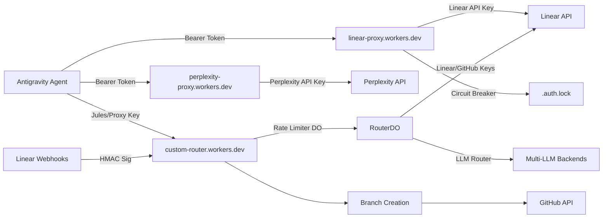

# Bifrost Bridge & Antigravity Learnings

## 1. Antigravity Terminal Persistence

**Problem**: Terminal profiles defined in `.antigravity/config` were acceptable but often overridden or ignored by the global VS Code/Antigravity context, leading to "default shell" fallbacks that lacked our portable tools.
**Solution**:

- We successfully injected the `PwshDev` profile directly into the **Global User Settings** (`AppData/Roaming/Antigravity/User/settings.json`).
- **Critical Configuration**:
  ```json
  "terminal.integrated.profiles.windows": {
      "PwshDev": {
          "path": ".../pwsh.exe",
          "args": ["-NoExit", "-Command", "...start checks..."],
          "env": { "PATH": "..." }
      }
  },
  "terminal.integrated.defaultProfile.windows": "PwshDev"
  ```
- **Key Insight**: Using `-c` (command) caused the terminal to execute and close immediately (appearing frozen). Changing to `-NoExit -Command` ensures the shell remains interactive.

## 2. Portable Python & Linter Type Safety

**Problem**: Strict linters (Pylance/Pyre) in the editor flag standard Python dynamic typing (like `sys.argv` slicing or `ssl.getpeercert()`) as errors because they can't infer the types from the portable runtime context.
**Solution**:

- **Explicit Casting**: We had to wrap `sys.argv[2:]` in `list(...)` to satisfy list indexing checks.
- **Type Hinting**: We explicitly typed dictionaries (e.g., `issuer: dict[str, str] = {}`) to prevent "Argument cannot be assigned to None" errors.
- **Defensive Coding**: Checked `if hasattr(e, 'read')` before calling it on Exceptions.

## 3. ESLint in 2026 (Modernization)

**Problem**: The project lacked linting, and legacy `.eslintrc` configurations are deprecated.
**Solution**:

- Integrated **ESLint v9** with "Flat Config" (`eslint.config.js`).
- Installed `typescript-eslint` for proper TS support.
- Added `npm run lint` and `npm run lint:fix` scripts.
- **Lesson**: `require()` imports in TypeScript files (`logger.ts`) need to be converted to `import * as x from 'x'` to comply with modern module standards.

## 4. Environment "Dominance"

**Concept**: The portable environment must strictly "prepend" itself to the PATH every time it launches.
**Implementation**:

- The `PwshDev` profile runs a startup check (`python --version`, etc.) every session.
- `bifrost.py` has a `refresh_environment()` function that forcibly reloads Registry keys into the current process to recover from system updates that might clobber variables.

## 5. Git & Large Files
**Problem**: The portable environment generates a `.tools` directory containing binaries (`node.exe`, `pwsh.zip`) that exceed GitHub's 100MB file size limit.
**Solution**:
- **Strategy**: The `.tools` directory MUST be added to `.gitignore`.
- **Repeatability**: `bifrost.py setup-shell` handles the download/setup of these tools on a fresh clone. Do not commit them.
- **Repeatability**: `bifrost.py setup-shell` handles the download/setup of these tools on a fresh clone. Do not commit them.

## 6. Secrets & Proxy Authentication

**Problem**: Cloudflare Worker authentication via `PROXY_API_KEY` was failing with `401 Unauthorized` despite the key appearing correct in `.env`.
**Root Cause**:
- Secrets piped from PowerShell/CMD (e.g., `'secret' | npx wrangler secret put`) often include invisible trailing whitespace or newlines.
- Cloudflare Workers received the newline as part of the secret.
- Constant-time comparison failed because `'key'` != `'key\n'`.

**Solution**:
- **Code Hardening**: Updated `linear-proxy` and `perplexity-proxy` to explicitly `.trim()` all incoming tokens and secrets before comparison.
- **Safe Uploads**: Use file redirection (`type secret.txt | wrangler ...`) or the interactive input to update secrets, avoiding shell pipe artifacts.
- **Verification**: Always verify "Direct" access first (`npm start -- linear projects --direct`) to isolate Proxy vs. Upstream issues.

## 7. Migration: Python to TypeScript
**Context**: We moved from `scripts/bifrost.py` to a `package.json`-driven workflow (`npm start`).
**Benefit**: Unified the tech stack. The CLI is now written in the same language (TypeScript) as the Workers and the application code, simplifying maintenance and reducing context switching.

## 8. Proxy Write Access (Mutations)
**Verified**: The `linear-proxy` successfully handles GraphQL mutations (creating issues/comments).
**Testing**:
- **Direct**: `npm start -- linear create-issue "Test" --direct` confirms API key permissions.
- **Proxy**: `npm start -- linear create-issue "Test"` confirms the proxy forwards the POST body correctly.
- **Circuit Breaker**: Write operations are also protected by the 401 circuit breaker to prevent key burn-out during auth failures.

## 9. Proxy Authentication Debugging (BIF-64)
**Problem**: 401 errors from linear-proxy despite correct `.env` configuration.

**Root Cause**: Trailing whitespace in `PROXY_API_KEY` secret in Cloudflare Worker.

**Solution**:
1. Redeploy worker with trimmed secret: `wrangler secret put PROXY_API_KEY`
2. Add `.trim()` to all secret comparisons in Workers
3. Circuit Breaker prevents key deactivation during debugging

**Lesson**: Always trim secrets and use constant-time comparison for security.

## 11. SQLite Migration Idempotency
**Problem**: The Event Store (`annals-of-ankou`) crashed during deployment because the initialization script attempted to create an index on a column that hadn't been added yet, or tried to add a column that already existed in the persistent volume.
**Solution**:
- Refactored `db.ts` to check `PRAGMA table_info(events)` before executing `ALTER TABLE`.
- Wrapped schema execution in a statement-by-statement loop with `try/catch` to ignore "already exists" errors.
- **Lesson**: Persistent volumes on Fly.io mean your database survives deployments; initialization code must be defensive and idempotent.

## 12. Cross-Cloud Networking (Cloudflare to Fly.io)
**Problem**: The Orchestrator (`crypt-core`) on Cloudflare could not reach the Event Store on Fly.io using the internal `.flycast` address.
**Root Cause**: `.flycast` and `.internal` domains are private to the Fly.io 6PN network. Cloudflare Workers operate outside this network.
**Solution**:
- Switched the `EVENTS_URL` to the public `.fly.dev` endpoint.
- Secured the endpoint with the `EVENTS_SECRET` middleware.
- **Lesson**: Use public endpoints with strong shared secrets for inter-cloud communication unless a dedicated tunnel (like Cloudflare Tunnel) is established.

## 13. GitHub Push Protection & Secret Scrubbing
**Problem**: Deployment was blocked by GitHub's push protection because API keys were accidentally committed in utility scripts.
**Solution**:
- Scrubbed all hardcoded keys and replaced them with `process.env` calls.
- Restored the local `.env` file (git-ignored) for local development stability.
- Used `git commit --amend` to purge secrets from the commit history.
- **Lesson**: "Zero Local Secrets" applies to committed code, but local `.env` is a valid fallback for reliability as long as it's never pushed.

## 14. System Architecture

