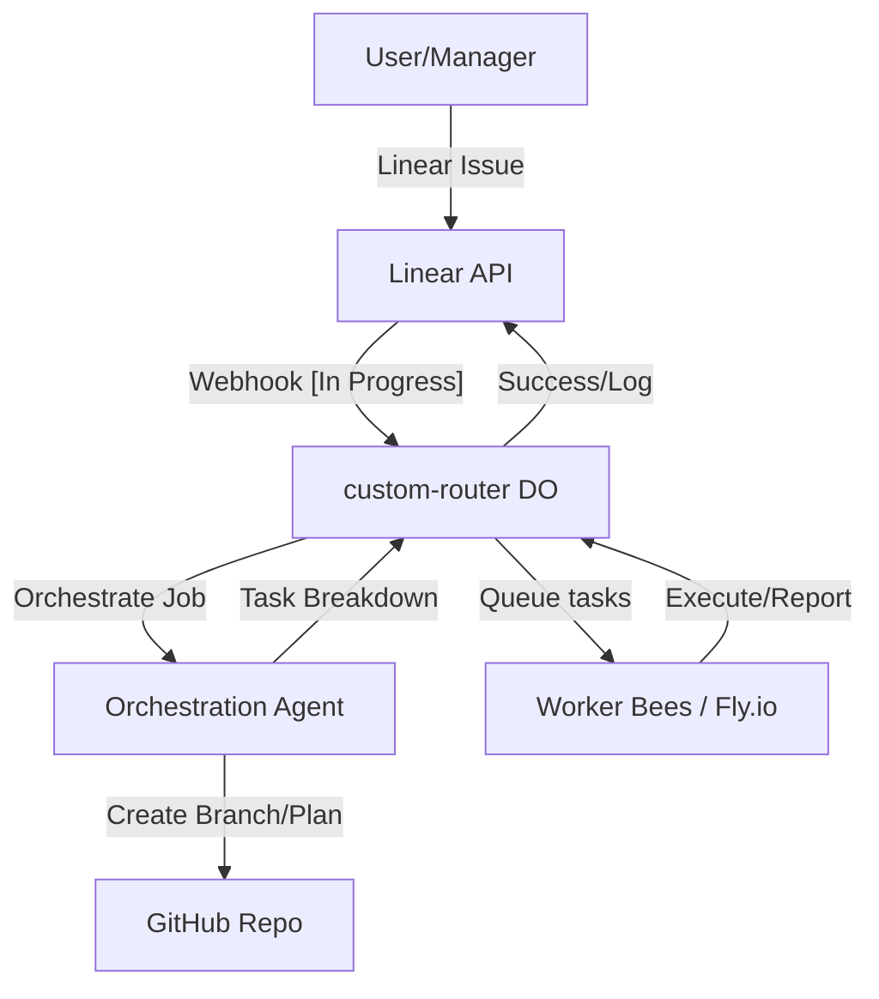

# Knowledge Base: Linear Swarm Integration Setup

This document outlines the architecture and configuration requirements for the Bifrost Bridge swarm's integration with Linear, centered around the `custom-router` and its coordination logic.

## Architecture Overview

The swarm uses a **Coordination Layer** implemented as a Cloudflare Worker with Durable Objects (`RouterDO`). This layer manages task lifecycle, autonomous orchestration, and multi-agent coordination.



## Configuration Requirements

### Worker Secrets (custom-router)
Must be set via `wrangler secret put`:
- `LINEAR_API_KEY`: API key for Linear interactions.
- `LINEAR_WEBHOOK_SECRET`: HMAC key for verifying Linear events.
- `LINEAR_TEAM_ID`: The UUID of the primary team.
- `GITHUB_APP_ID`, `GITHUB_PRIVATE_KEY`, `GITHUB_INSTALLATION_ID`: For repository interactions.
- `DEEPSEEK_API_KEY`, etc.: LLM provider keys for routing and planning.

## Label Lifecycle System

The swarm uses specific labels to transition tasks through automation stages:

| Label           | Meaning               | Action                                              |
| :-------------- | :-------------------- | :-------------------------------------------------- |
| `swarm:ready`   | Ready for pick-up     | `RouterDO` will autonomously checkout and plan.     |
| `swarm:active`  | In execution          | Task is actively being processed by the swarm.      |
| `swarm:review`  | Verification done     | Awaiting human feedback before merge/completion.    |
| `swarm:blocked` | Terminal failure      | Human intervention required; logs posted to Linear. |
| `agent:jules`   | Orchestrator Assigned | Jules is managing the workspace and planning.       |

## Metadata-Driven Routing

Agents parse the Linear issue description for a `Metadata:` block to understand task requirements:

```markdown
Metadata:
TaskType: maintenance
RiskProfile: medium
Priority: 50
BudgetMax: 1000
SuccessCriteria: All tests pass.
```

## Safety & Rate Limiting

The `RouterDO` implements a **Token Bucket** algorithm with a **Health Score** multiplier.
- **Healthy**: Refill at 100% rate.
- **Stressed** (High queue depth): Refill at 50% rate.
- **Critical** (Extreme load): Refill at 10% rate.
