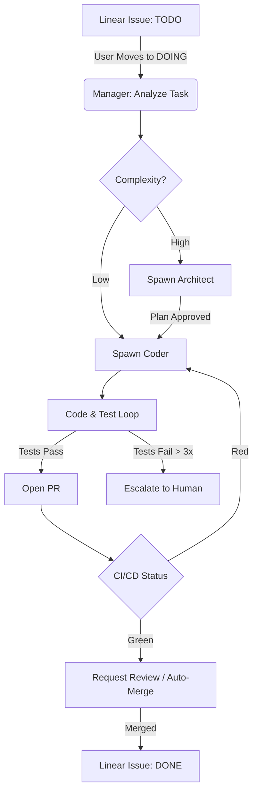

# Bifrost "Manager Agent" Flow (The Linear Spine) 🧠

> [!IMPORTANT]
> This is the design specification for the **Manager Agent** (also referred to as "Linear Spine" or "Linear Event Monitor"). It is the autonomous nervous system of Bifrost, responsible for keeping the Linear board (The Brain) in sync with the Codebase (The Body).

## 1. Core Philosophy: "The Board is the Truth"

In Bifrost, **Linear is the database of intent**. The Codebase is the **manifestation of that intent**. The Manager Agent's job is to ensure these two states are eventually consistent.

- **Inputs**: Linear Webhooks (Issue Created, Status Changed, Comment Added), GitHub Webhooks (PR Opened, CI/CD Status).
- **Processing**: Event Sourcing (managed by `ManagerDO` + SQLite).
- **Outputs**: Dispatching Worker Agents (Coder, Validator), Updating Linear Issues, Merging PRs.

## 2. The Loop: Monitor, Dispatch, Reconcile

### A. Monitor (The "Ear")
The `ManagerDO` (Durable Object) listens for webhooks.

1.  **Issue Triage**:
    *   **Trigger**: New Issue Created in Linear.
    *   **Action**: Manager analyzes the issue description.
        *   *If clear spec*: Assigns `Status: Ready`.
        *   *If vague*: Adding comment "@creator, please clarify X, Y, Z" (using Architect Agent).
2.  **State Transitions**:
    *   **Trigger**: Issue moved to `In Progress`.
    *   **Action**: Manager spawns a **Coder Agent**.
        *   Create feature branch: `feat/BIF-123-description`.
        *   Generates `implementation_plan.md`.
        *   Posts plan to Linear comment for HITL approval (or auto-approves if confidence > 90%).

### B. Dispatch (The "Hand")
Once a task is `In Progress` and scoped, the Manager orchestrates the work.

1.  **Agent Instantiation**:
    *   Manager calls `RouterDO` to spawn a `Coder` (via MCP or HTTP).
    *   Context provided: Issue Title, Description, Related Linear Docs, `project-context.md`.
2.  **Work Execution**:
    *   Coder Agent writes code, runs tests locally.
    *   **Self-Correction**: If tests fail, Coder iterates (max 3 times).
    *   **PR Creation**: Coder pushes branch and opens PR with summary.

### C. Reconcile (The "Eye")
The Manager watches the PR and CI/CD status.

1.  **Validation**:
    *   **Trigger**: GitHub Actions CI finishes (Success/Fail).
    *   **Action**:
        *   *Success*: Manager spawns **Validator Agent** (or uses internal logic) to do a sanity check (lint, typecheck).
        *   *Failure*: Manager comments on PR with error logs, tags Coder Agent to fix.
2.  **Completion**:
    *   **Trigger**: PR Merged.
    *   **Action**:
        *   Move Linear Issue to `Done`.
        *   Post comment: "Deployed in PR #45. Validation passed."
        *   Update `STATUS.md` (Session Continuity).

## 3. The "Manager Flow" (Detailed State Machine)

This flow is implemented using **LangGraph** (V4-001) or **Temporal** (V4-004).

## 4. Implementation Priorities (How to Build This)

1.  **Ingestion (M1)**: Build `LinearWebhookHandler` in `RouterDO`. Just log events for now.
2.  **Triage (M1)**: Simple rule: If moved to `In Progress` -> create GitHub Branch automatically.
3.  **Orchestration (M2)**: Hook up `Coder` agent. If moved to `In Progress` -> Generate Plan.
4.  **Autonomy (M3)**: Full loop. Move to `In Progress` -> PR appears hour later.

## 5. The "Thin Slice" for Now

We don't need Temporal yet. We can do this with **Cloudflare Queues** and **CRON triggers**.

**The `ManagerWorker`**:
- **Endpoint**: `POST /webhooks/linear`
- **Queue**: `task-queue`
- **Consumer**: Pops task, calls `BifrostModel` (Proprietary Router), updates Linear.

This is the "Linear Project Manager Flow" that manages "All The Things".
