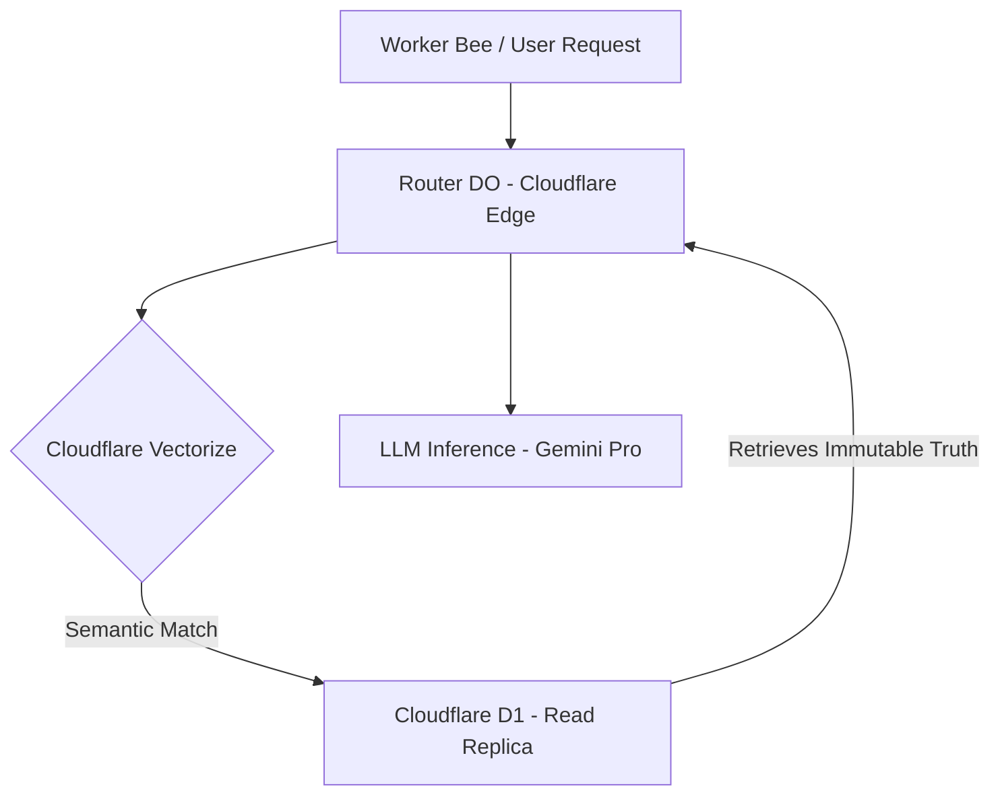

# Local Knowledge Architecture & The Path to Cloud

This document outlines the architectural vision for transitioning our local documentation scraper pipeline into a highly available, globally distributed "Immutable Truths" engine on Cloudflare.

## 1. The Concept of "Immutable Truths"

In our system, "Immutable Truths" represent the raw, fundamental documentation and facts scraped from official sources, parsed, and semantically embedded. Once ingested, they represent a locked point-in-time understanding of an official API or SDK.

### Why Immutability?

- **Auditable Context**: We always know _why_ an AI agent made a decision based on the exact state of the docs at that time.
- **RAG Consistency**: Re-running agents against historic immutable truths yields consistent behavior.

## 2. Local-First Architecture (The Scraper)

We build locally for fast iteration, zero-deploy latency, and simple debugging.

- **Local Storage**: `sqlite3` database with the `sqlite-vec` extension for local vector embeddings and `FTS5` for full-text search.
- **SQLite Optimizations**:
  - `PRAGMA journal_mode = WAL;` (Write-Ahead Logging) for concurrent read/writes.
  - `PRAGMA synchronous = NORMAL;` to maintain speed.
  - Wrap massive insert operations (extracting thousands of code blocks) inside `BEGIN TRANSACTION; ... COMMIT;` for 10x-20x speedups.
- **LLM Pipeline**:
  - **Perplexity**: For targeted URL discovery and finding the correct, up-to-date sitemaps.
  - **Gemini Flash Lite**: Used as the inexpensive first-pass for HTML-to-Markdown and structured JSON extraction. Only escalate to `gemini-flash` or `gemini-pro` if `flash-lite` fails validation.
  - **Chunking**: Stream process large HTML; use semantic chunking over simple token-splitting to ensure headers remain attached to code blocks.

## 3. The Path to Cloud (Cloudflare D1 & Vectorize)

When the local pipeline is perfected and the `library.sqlite` is populated, the transition to Cloudflare is designed to be seamless.

### Phase A: Migration of Truths

1. **D1 Import**: Wrangler allows direct import of local SQLite files. We will convert our local `library.sqlite` into a baseline Cloudflare D1 database.
2. **Vectorize Migration**: The `sqlite-vec` embeddings will be extracted and pushed into Cloudflare Vectorize. D1 will store the metadata and the Vector ID.

### Phase B: Fast Access via Workers

- **Globally Distributed Reads**: Cloudflare D1 uses local read replicas automatically. Any Worker querying for an "immutable truth" will hit the closest regional edge, resulting in near-zero latency.
- **Time Travel**: D1 natively supports 30-day Time Travel. This acts as a rolling backup and a natural extension of our "immutable" concept—we can query the state of our knowledge graph at a specific minute in the past.
- **Worker AI**: Cloudflare Workers AI can generate embeddings on the fly at the edge to query Vectorize, completely bypassing the need to round-trip to OpenAI or remote embedding APIs for retrieval.

## 4. Final Cloud Topology

