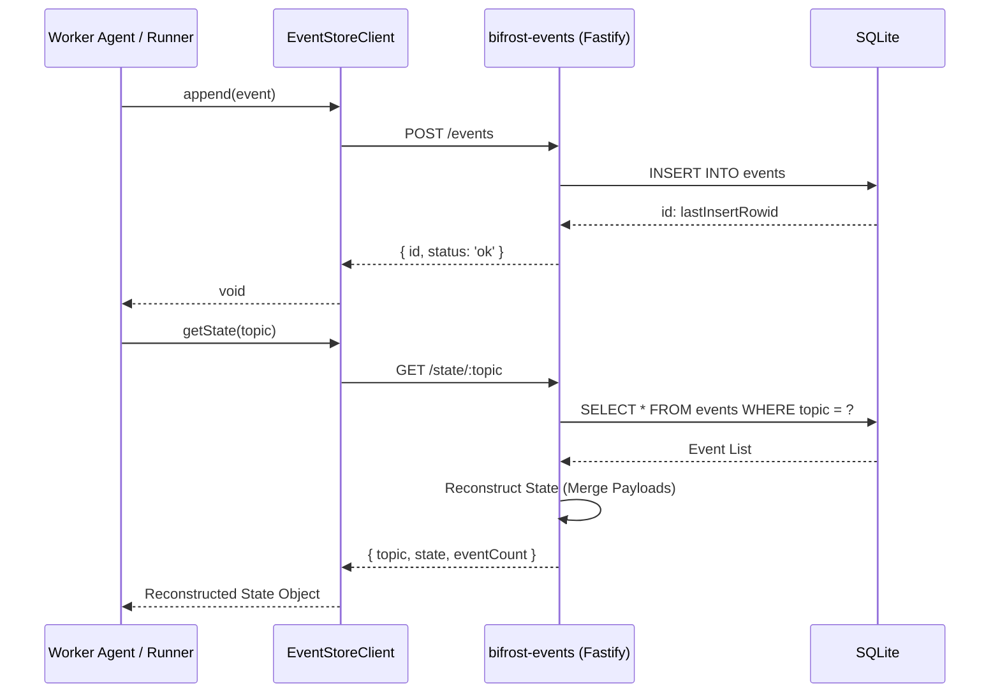

# Architecture: Annals of Ankou (bifrost-events)

## Overview

**Annals of Ankou** is the central event sourcing engine for the Bifrost Bridge swarm. It provides a persistent, append-only record of all significant system events, enabling state replay, auditability, and multi-agent coordination.

## Components

- **Fastify Server**: Handles HTTP requests and routing.
- **Better-SQLite3**: Local persistent storage for high-performance event logging.
- **EventStoreClient**: TypeScript client used by other workers (e.g., `custom-router`) to interact with the engine.

## Data Flow

The following diagram illustrates the lifecycle of an event from creation to consumption.

## Storage Schema

Events are stored in a single `events` table with the following structure:

| Column         | Type                  | Description                                   |
| -------------- | --------------------- | --------------------------------------------- |
| id             | INTEGER PRIMARY KEY   | Auto-incrementing unique identifier.          |
| type           | TEXT                  | The event category (e.g., `JOB_CREATED`).     |
| source         | TEXT                  | The system or agent that triggered the event. |
| topic          | TEXT (Optional)       | Used for state replay and grouping.           |
| correlation_id | TEXT (Optional)       | Traces requests across multiple services.     |
| payload        | TEXT (JSON)           | The core event data.                          |
| meta           | TEXT (JSON, Optional) | Additional non-structural metadata.           |
| timestamp      | DATETIME              | Automatic insertion time.                     |

## API Endpoints

### `POST /events`

Appends a new event.

- **Body**: `{ type, source, topic?, correlation_id?, payload, meta? }`
- **Response**: `{ id, status: 'ok' }`

### `GET /state/:topic`

Replays all events for a topic to reconstruct current state.

- **Response**: `{ topic, state: Object, eventCount: Number }`

### `GET /events`

Retrieves a list of recent events.

- **Query Params**: `limit` (default 100), `type` (optional filter).
- **Response**: Array of event objects.

### `GET /events/count` (New)

Returns the total number of events in the store.

- **Response**: `{"count": N}`

### `GET /health`

Basic health check.

- **Response**: `{"status": "ok"}`

## Troubleshooting

- **Database Locked**: Ensure only one process is accessing the SQLite file at a time (Fastify handles this internally).
- **Unauthorized**: Ensure the `Authorization: Bearer <secret>` header matches the `EVENTS_SECRET` environment variable.
